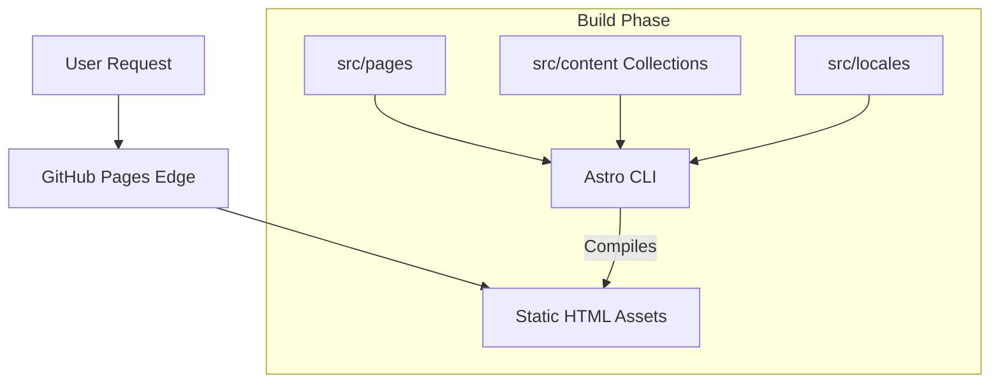

# Project Overview

This repository hosts the personal portfolio and blog of Almir Dev, a software engineer specializing in the TypeScript ecosystem. Built with Astro, it serves as a high-performance, statically generated web application that features multi-language support (i18n), dynamic content collections (Markdown) for projects and blog posts, and a meticulously crafted UI using Tailwind CSS.

## Repository Structure

- `.github/` - Contains GitHub Actions workflows for CI/CD, including automated deployment to GitHub Pages.
- `.husky/` - Git hooks for pre-commit linting and formatting.
- `public/` - Static assets served directly at the root (e.g., images, diagrams, `favicon.ico`, `robots.txt`).
- `src/` - The main source code directory containing all Astro components and logic.
  - `src/assets/` - Processed images and assets used within components.
  - `src/components/` - Reusable UI components (Header, Footer, SEO, custom Markdown wrappers).
  - `src/content/` - Markdown files defining the data schema for blog posts and projects.
  - `src/layouts/` - Base HTML shell templates shared across pages.
  - `src/locales/` - JSON dictionaries for internationalization (PT and EN).
  - `src/pages/` - File-based routing, including dynamic `[lang]` directories for localized content.
  - `src/styles/` - Global CSS stylesheets, including Tailwind directives.
  - `src/utils/` - Helper functions, such as reading time calculators.

## Build & Development Commands

```bash
# Install dependencies
npm install

# Start the local development server
npm run dev

# Build the site for production
npm run build

# Preview the production build locally
npm run preview

# Run ESLint to check for code issues
npm run lint

# Format the codebase using Prettier
npm run format

# Verify formatting without applying changes
npm run format:check
```

## Code Style & Conventions

- **Framework:** Astro for structure, React/Vanilla JS logic where necessary.
- **Styling:** Tailwind CSS utility classes within the `class` attribute.
- **Typing:** Strict TypeScript (`tsconfig.json`).
- **Linting & Formatting:** ESLint and Prettier are configured; the `.prettierrc` enforces consistency.
- **Commits:** Conventional Commits format is required (e.g., `feat:`, `fix:`, `chore:`, `docs:`), enforced locally via Husky hooks.
- **i18n:** Hardcoded strings should be avoided in components; use the `t()` function from `src/i18n.ts` pointing to `src/locales/`.

## Architecture Notes



The architecture leverages Astro's Static Site Generation (SSG). During the build process, Astro reads Markdown files from `src/content/` and translates JSON files from `src/locales/` to generate static `.html` files for each supported language route (`/en/*` and `/pt/*`). Once compiled, the static bundle is pushed to GitHub Pages, meaning there is no backend server at runtime.

## Testing Strategy

Due to the simplified nature of this portfolio project, testing relies purely on strict TypeScript compilation and ESLint static analysis rather than heavy unit or E2E testing frameworks.

## Security & Compliance

- **Dependencies:** Regularly scan using `npm audit` or GitHub Dependabot.
- **Hooks:** A `husky` pre-commit hook ensures formatting and linting rules pass before any code is checked into version control.
- **CI/CD Guardrails:** `deploy.yml` will halt the deployment if the build or formatting checks fail. `npm ci` handles dependencies in CI, with `prepare` scripts safely bypassed if Husky is unavailable.

## Design Philosophy: Less is More

The core guiding principle for this project is "Less is More". When creating components, writing markdown content, or suggesting architectural changes, future agents MUST strictly adhere to the following rules:
- **Only use what aggregates value:** Do not over-engineer or add complex components just because you can. Stick to simple native HTML/Markdown if it suffices.
- **Use custom MDX components sparingly:** Elements like `<Callout>`, `<Terminal>`, `<ArticleImage>`, and `<Quote>` should only be used when they provide a clear, undeniable UX benefit or semantic necessity. Do NOT use them as default replacements for standard text just to make the page look busy.
- **Performance First:** Prefer Tailwind utility classes and minimal Vanilla JS over bringing in heavy UI frameworks or state-driven interactivity. The site is a fast, static blog; do not introduce backend-level maintenance burdens or dependencies.

## Agent Guardrails

- **No Direct `main` Commits Without Formatting:** Ensure `npm run format` is executed before committing.
- **Assets Directory:** Do not delete or rename images in `public/` without explicit permission, as they may be tightly coupled to markdown content or Open Graph meta tags.
- **Configuration Modesty:** Avoid installing new massive dependencies (like heavy UI libraries) unless explicitly requested. Prefer Tailwind CSS classes and lightweight Astro components.
- **SEO Constraints:** When generating SEO descriptions, do not exceed 155 characters for standard meta tags and 120 characters for Open Graph tags.

## Extensibility Hooks

- **Content Collections:** New content types (e.g., talks, snippets) can be added by defining a new schema in `src/content.config.ts`.
- **Languages:** Adding a new language requires updating `src/locales/`, mapping it in `src/i18n.ts`, and ensuring dynamic routes in `src/pages/[lang]/` support the new key.
- **Styling:** Extend the Tailwind theme inside the `@theme` directive in `src/styles/global.css`.

## Further Reading

- [Astro Documentation](https://docs.astro.build/)
- [Tailwind CSS Documentation](https://tailwindcss.com/docs)
