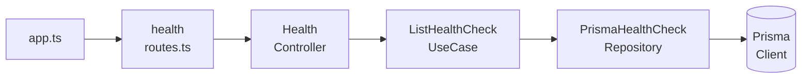

If you've ever tried to write unit tests for a Node.js application using Express, you've probably encountered one of the biggest obstacles to testability: tight coupling.

When we import Prisma, a Logger, or external services directly within the scope of our *controllers*, we create a rigid dependency. Mocking these global dependencies using `vi.mock()` often leads to fragile tests that are difficult to maintain.

In this article, we'll explore how to resolve this architectural issue through Constructor Dependency Injection. Our goal is to implement this pattern using pure TypeScript, avoiding the overhead of complex frameworks like NestJS or InversifyJS.

## The Coupling Problem

Generally, the implementation of a simple Express route for a Health Check looks something like this:

```typescript
// controllers/health.controller.ts
import { Request, Response } from "express";
import { prisma } from "../config/db"; // Implicit rigid dependency

export async function handleIndex(req: Request, res: Response) {
  const records = await prisma.healthCheck.findMany();
  return res.status(200).json({ data: records });
}
```

And the route file would be responsible only for the routing setup:

```typescript
// routes/health.routes.ts
import { Router } from "express";
import { handleIndex } from "../controllers/health.controller";

const router = Router();
router.get("/", handleIndex);

export { router };
```

If we want to test the `handleIndex` function, how do we inject a simulated (mock) `prisma` instance into it? The function's signature accepts no parameters other than `req` and `res`. We would be forced to use Vitest mechanisms to intercept the `import`, which not only slows down the test execution but also tightly couples the test suite to the application's file structure.

## The Solution: Constructor Injection

One of the fundamental principles of object-oriented design is the Inversion of Control. If a class requires a resource to function, it should not instantiate or import it directly, but rather demand it through its constructor.

Let's refactor our Controller by turning it into a class:

```typescript
// controllers/health.controller.ts
import { Request, Response } from "express";
import { ListHealthCheckUseCase } from "../usecases/list-health-check.usecase";

export class HealthController {
  // Injecting dependencies explicitly in the constructor
  constructor(
    private readonly listHealthCheckUseCase: ListHealthCheckUseCase
  ) {}

  async handleIndex(req: Request, res: Response) {
    const records = await this.listHealthCheckUseCase.execute();
    return res.status(200).json({ data: records, status: "ok" });
  }
}
```

Following the same principle, the `ListHealthCheckUseCase` will not import Prisma directly. It will require a repository at instantiation time:

```typescript
// usecases/list-health-check.usecase.ts
export class ListHealthCheckUseCase {
  constructor(private readonly repository: HealthCheckRepository) {}

  async execute() {
    return this.repository.findMany();
  }
}
```

## Painless Unit Testing

By isolating the dependencies, the testing environment becomes predictable. We can provide simulated instances that adhere to the same interface without relying on complex module mocking:

```typescript
// __tests__/health.controller.test.ts
import { vi, test, expect } from "vitest";
import { Request } from "express";
import { HealthController } from "../controllers/health.controller";

test("should return records with status 200", async () => {
  // We create a simulated object (stub) for the dependency
  const mockUseCase = { 
    execute: async () => [{ id: 1, status: "ok" }] 
  } as any;
  
  // We manually inject the dependency
  const controller = new HealthController(mockUseCase);
  
  const req = {} as Request;
  const res = { 
    status: vi.fn().mockReturnThis(), 
    json: vi.fn() 
  } as any;
  
  await controller.handleIndex(req, res);
  
  expect(res.status).toHaveBeenCalledWith(200);
  expect(res.json).toHaveBeenCalledWith({ data: [{ id: 1, status: "ok" }], status: "ok" });
});
```

The absence of `vi.mock()` makes the test execution faster and guarantees that the isolation was achieved at the software design level, rather than through tooling workarounds.

## The Composition Root (Module Factories)

A natural question arises: *"If the controller doesn't instantiate its dependencies, who is responsible for doing so?"*

Every application requires a central location responsible for constructing the dependency graph, known as the **Composition Root**. In Express applications, an excellent approach is the use of *Module Factories*.



```typescript
// routes/health.routes.ts
import { Router } from "express";
import { HealthController } from "../controllers/health.controller";

export function createHealthRouter(controller: HealthController) {
  const router = Router();
  
  // Using .bind ensures the 'this' context is preserved
  router.get("/", controller.handleIndex.bind(controller));
  
  return router;
}
```

At the application's entry point (`app.ts` or `server.ts`), we chain the initialization of these instances:

```typescript
// app.ts
import express from "express";
import { PrismaClient } from "@prisma/client";
import { HealthController } from "./controllers/health.controller";
import { ListHealthCheckUseCase } from "./usecases/list-health-check.usecase";
import { PrismaHealthCheckRepository } from "./repositories/prisma-health-check.repository";
import { createHealthRouter } from "./routes/health.routes";

export function createHealthModule(prisma: PrismaClient) {
  // 1. Instantiate the data layer (Repository)
  const repository = new PrismaHealthCheckRepository(prisma);

  // 2. Instantiate the business logic layer (Use Case)
  const listHealthCheckUseCase = new ListHealthCheckUseCase(repository);

  // 3. Instantiate the presentation layer (Controller)
  const controller = new HealthController(listHealthCheckUseCase);

  // 4. Return the fully configured router
  return createHealthRouter(controller);
}

export function createApplication() {
  const app = express();
  const prisma = new PrismaClient(); // Real connection established at the root

  app.use("/health", createHealthModule(prisma));

  return app;
}
```

## Conclusion

Although the TypeScript ecosystem offers great dependency injection frameworks like TSyringe, Inversify, or the entire NestJS ecosystem based on *decorators*, they can introduce an abstraction layer that is often unjustified in smaller projects or microservices.

<Callout type="info" title="Why avoid decorators?">
  Robust frameworks are excellent for complex applications, but decorators require additional setup (`experimentalDecorators`) and third-party packages like `reflect-metadata`, since TypeScript lacks native runtime Reflection like Java or C#. For clarity-focused APIs, the manual approach removes this "magic" and keeps dependencies explicit.
</Callout>

By applying classic concepts such as Constructor Injection paired with factory patterns, we achieve a highly readable, testable architecture with no hidden dependencies, leveraging the best of what TypeScript natively provides.
