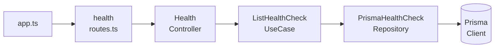

Se você já tentou escrever testes unitários para uma aplicação Node.js usando Express, provavelmente já esbarrou em um dos maiores obstáculos da testabilidade: o alto acoplamento.

Quando importamos o Prisma, um Logger ou serviços externos diretamente no escopo dos nossos *controllers*, criamos uma dependência rígida. Mockar essas dependências globais usando `vi.mock()` frequentemente resulta em testes frágeis e de difícil manutenção.

Neste artigo, exploraremos como solucionar esse cenário arquitetural através da Injeção de Dependências via Construtor (Constructor Injection). A ideia é implementar esse padrão utilizando TypeScript puro, sem a necessidade de frameworks complexos como NestJS ou InversifyJS.

## O Problema do Acoplamento

Geralmente, a implementação de uma rota simples no Express para checagem de saúde (Health Check) se assemelha a isto:

```typescript
// controllers/health.controller.ts
import { Request, Response } from "express";
import { prisma } from "../config/db"; // Dependência rígida implícita

export async function handleIndex(req: Request, res: Response) {
  const records = await prisma.healthCheck.findMany();
  return res.status(200).json({ data: records });
}
```

E o arquivo de rotas ficaria encarregado apenas do roteamento:

```typescript
// routes/health.routes.ts
import { Router } from "express";
import { handleIndex } from "../controllers/health.controller";

const router = Router();
router.get("/", handleIndex);

export { router };
```

Se quisermos testar a função `handleIndex`, como injetamos um `prisma` simulado (mock) para ela? A assinatura da função não aceita parâmetros além de `req` e `res`. Seríamos obrigados a utilizar mecanismos do Vitest para interceptar o `import`, o que além de tornar o teste mais lento, acopla a suíte de testes à estrutura de arquivos da aplicação.

## A Solução: Injeção via Construtor

Um dos princípios fundamentais do design orientado a objetos é a Inversão de Controle. Se uma classe precisa de um recurso para funcionar, ela não deve instanciá-lo ou importá-lo diretamente, mas sim exigi-lo através do seu construtor.

Vamos refatorar nosso Controller transformando-o em uma classe:

```typescript
// controllers/health.controller.ts
import { Request, Response } from "express";
import { ListHealthCheckUseCase } from "../usecases/list-health-check.usecase";

export class HealthController {
  // Injetando as dependências de forma explícita no construtor
  constructor(
    private readonly listHealthCheckUseCase: ListHealthCheckUseCase
  ) {}

  async handleIndex(req: Request, res: Response) {
    const records = await this.listHealthCheckUseCase.execute();
    return res.status(200).json({ data: records, status: "ok" });
  }
}
```

Seguindo o mesmo princípio, o caso de uso `ListHealthCheckUseCase` não importará o Prisma diretamente. Ele exigirá um repositório no momento de sua instanciação:

```typescript
// usecases/list-health-check.usecase.ts
export class ListHealthCheckUseCase {
  constructor(private readonly repository: HealthCheckRepository) {}

  async execute() {
    return this.repository.findMany();
  }
}
```

## Testes Unitários Descomplicados

Ao isolarmos as dependências, o ambiente de testes torna-se previsível. Podemos fornecer instâncias simuladas que respeitam a mesma interface sem depender de manipulações complexas de módulos:

```typescript
// __tests__/health.controller.test.ts
import { vi, test, expect } from "vitest";
import { Request } from "express";
import { HealthController } from "../controllers/health.controller";

test("deve retornar os registros com status 200", async () => {
  // Criamos um objeto simulado (stub) para a dependência
  const mockUseCase = { 
    execute: async () => [{ id: 1, status: "ok" }] 
  } as any;
  
  // Injetamos a dependência manualmente
  const controller = new HealthController(mockUseCase);
  
  const req = {} as Request;
  const res = { 
    status: vi.fn().mockReturnThis(), 
    json: vi.fn() 
  } as any;
  
  await controller.handleIndex(req, res);
  
  expect(res.status).toHaveBeenCalledWith(200);
  expect(res.json).toHaveBeenCalledWith({ data: [{ id: 1, status: "ok" }], status: "ok" });
});
```

A ausência de `vi.mock()` torna a execução do teste mais rápida e garante que o isolamento foi feito a nível de design de software, e não via tooling.

## O Composition Root (Module Factories)

A pergunta natural que surge é: *"Se o controller não instancia suas dependências, quem é responsável por isso?"*

Toda aplicação precisa de um ponto central responsável pela criação do grafo de dependências, conhecido como **Composition Root**. Em aplicações Express, uma excelente abordagem é a utilização de *Module Factories* (Fábricas de Módulos).



```typescript
// routes/health.routes.ts
import { Router } from "express";
import { HealthController } from "../controllers/health.controller";

export function createHealthRouter(controller: HealthController) {
  const router = Router();
  
  // O uso do .bind garante que o contexto do 'this' não seja perdido
  router.get("/", controller.handleIndex.bind(controller));
  
  return router;
}
```

No ponto de entrada da aplicação (`app.ts` ou `server.ts`), encadeamos a inicialização dessas instâncias:

```typescript
// app.ts
import express from "express";
import { PrismaClient } from "@prisma/client";
import { HealthController } from "./controllers/health.controller";
import { ListHealthCheckUseCase } from "./usecases/list-health-check.usecase";
import { PrismaHealthCheckRepository } from "./repositories/prisma-health-check.repository";
import { createHealthRouter } from "./routes/health.routes";

export function createHealthModule(prisma: PrismaClient) {
  // 1. Instanciamos a camada de dados (Repositório)
  const repository = new PrismaHealthCheckRepository(prisma);

  // 2. Instanciamos a camada de negócio (Caso de Uso)
  const listHealthCheckUseCase = new ListHealthCheckUseCase(repository);

  // 3. Instanciamos a camada de apresentação (Controller)
  const controller = new HealthController(listHealthCheckUseCase);

  // 4. Retornamos o roteador devidamente configurado
  return createHealthRouter(controller);
}

export function createApplication() {
  const app = express();
  const prisma = new PrismaClient(); // Conexão real estabelecida na raiz

  app.use("/health", createHealthModule(prisma));

  return app;
}
```

## Conclusão

Embora o ecossistema TypeScript possua ótimos frameworks de injeção de dependências como o TSyringe, Inversify ou todo o ecossistema do NestJS baseados em *decorators*, eles podem introduzir uma camada de abstração que muitas vezes não se justifica em projetos menores ou microserviços.

<Callout type="info" title="Por que evitar decorators?">
  Frameworks robustos são excelentes para aplicações complexas, mas o uso de decorators exige configuração adicional (`experimentalDecorators`) e pacotes de terceiros como o `reflect-metadata`, já que o TypeScript não possui Reflection nativa no *runtime* como o Java ou C#. Para APIs focadas em clareza, a abordagem manual elimina essa "magia" e mantém as dependências explícitas.
</Callout>

Ao aplicarmos conceitos clássicos como Injeção via Construtor aliada a padrões de fábrica, obtemos uma arquitetura extremamente legível, testável e sem dependências ocultas, aproveitando o que o TypeScript oferece nativamente de melhor.
